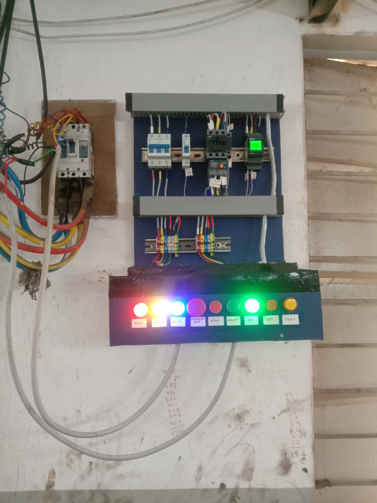
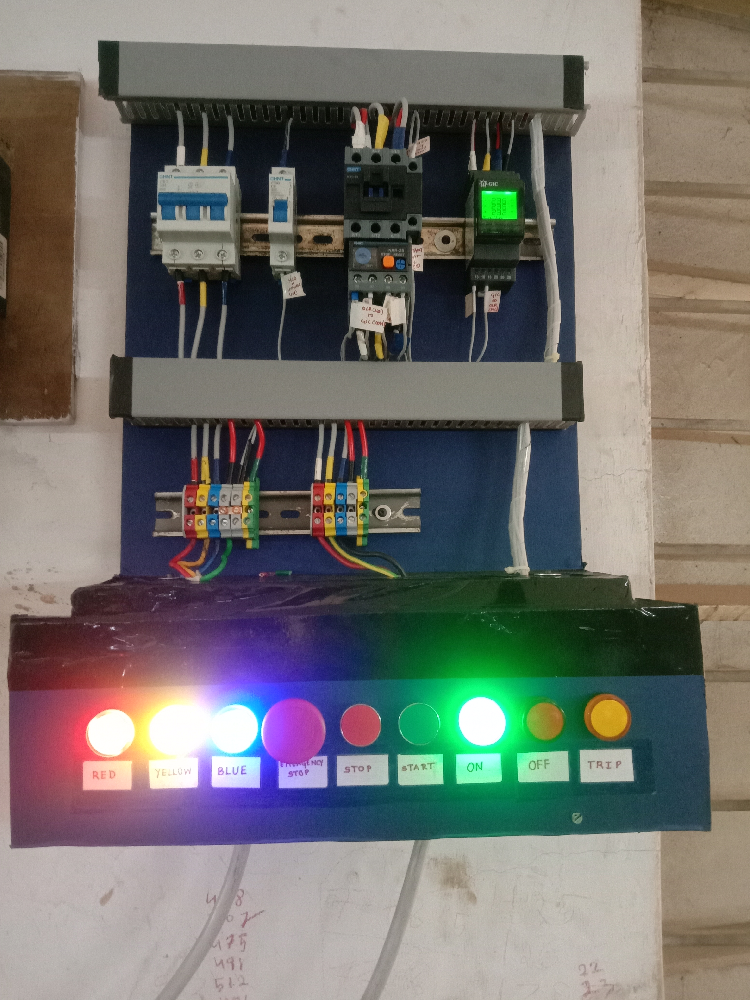

# 3 phase DOL induction motor protection panel
---
-   This panel was built to provide AC induction motor protection against undervoltage, overvoltage phase unbalance, phase loss, and overloading current conditions.  
-   This panel is equipped with an auto shutoff feature so that if any of the faulty conditions occurs it can shut the whole system down which protects the motor from burning.
---

### Images

